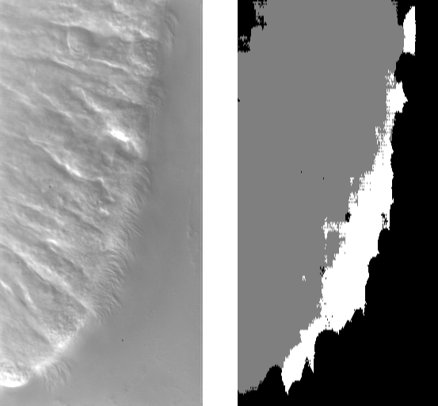

vraska-p3
==============================

## Project 3: Cilia Segmentation

>Cilia are microscopic hairlike structures that protrude from every cell in the human body. They beat in regular, rhythmic patterns to perform myriad tasks, from moving nutrients in to moving irritants out to amplifying cell-cell signaling pathways to generating calcium fluid flow in early cell differentiation. Cilia, and their beating patterns, are increasingly being implicated in a wide variety of syndromes that affected multiple organs.
- Dr. Shannon Quinn

## Synopsis
The purpose of this project was to apply various image segmentation techniques to a set of images of cells and attempt to segment and identify the cilia. We implemented a U-net Convolutional Neural Network for semantic segmentation to accomplish this.

## Dependencies
- numpy
- pandas
- tensorflow
- keras
- skimage
- cv2
- matplotlib
- tqdm

## Approach
We decided, after spending some time pouring over the Tiramisu model, to go with a U-net model. U-net is a convolutional neural network that was modified by its creators to work with fewer training images and yeild more precise results.

> E. Shelhamer, J. Long and T. Darrell, "Fully Convolutional Networks for Semantic Segmentation," in IEEE Transactions on Pattern Analysis and Machine Intelligence, vol. 39, no. 4, pp. 640-651, 1 April 2017, doi: 10.1109/TPAMI.2016.2572683.

## Preliminary Results

After 10 epochs at 16 steps per epoch, the U-net model produces decent results very quickly. For future work, we could improve the results through preprocessing.

Project Organization
------------

    ├── LICENSE
    ├── Makefile           <- Makefile with commands like `make data` or `make train`
    ├── README.md          <- The top-level README for developers using this project.
    ├── data
    │   ├── external       <- Data from third party sources.
    │   ├── interim        <- Intermediate data that has been transformed.
    │   ├── processed      <- The final, canonical data sets for modeling.
    │   └── raw            <- The original, immutable data dump.
    │
    ├── docs               <- A default Sphinx project; see sphinx-doc.org for details
    │
    ├── models             <- Trained and serialized models, model predictions, or model summaries
    │
    ├── notebooks          <- Jupyter notebooks. Naming convention is a number (for ordering),
    │                         the creator's initials, and a short `-` delimited description, e.g.
    │                         `1.0-jqp-initial-data-exploration`.
    │
    ├── references         <- Data dictionaries, manuals, and all other explanatory materials.
    │
    ├── reports            <- Generated analysis as HTML, PDF, LaTeX, etc.
    │   └── figures        <- Generated graphics and figures to be used in reporting
    │
    ├── requirements.txt   <- The requirements file for reproducing the analysis environment, e.g.
    │                         generated with `pip freeze > requirements.txt`
    │
    ├── setup.py           <- makes project pip installable (pip install -e .) so src can be imported
    ├── src                <- Source code for use in this project.
    │   ├── __init__.py    <- Makes src a Python module
    │   │
    │   ├── data           <- Scripts to download or generate data
    │   │   └── make_dataset.py
    │   │
    │   ├── features       <- Scripts to turn raw data into features for modeling
    │   │   └── build_features.py
    │   │
    │   ├── models         <- Scripts to train models and then use trained models to make
    │   │   │                 predictions
    │   │   ├── predict_model.py
    │   │   └── train_model.py
            ├── unit.ipynb  <- Notebook to build and train the model
    │   │   └── unet.py
    │   │
    │   └── visualization  <- Scripts to create exploratory and results oriented visualizations
    │       └── visualize.py
    │
    └── tox.ini            <- tox file with settings for running tox; see tox.readthedocs.io

--------

### References
We referenced the Tensorflow documentation [here](https://www.tensorflow.org/tutorials/images/segmentation) in some of our .py files as a starting point to get acclimated to using the U-net model, but most of our final work only slightly extends from some of the code examples on the documentation site.

<small>Project based on the <a target="_blank" href="https://drivendata.github.io/cookiecutter-data-science/">cookiecutter data science project template</a>. #cookiecutterdatascience</small>

